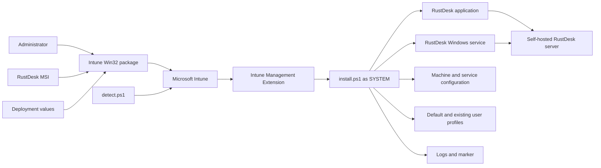
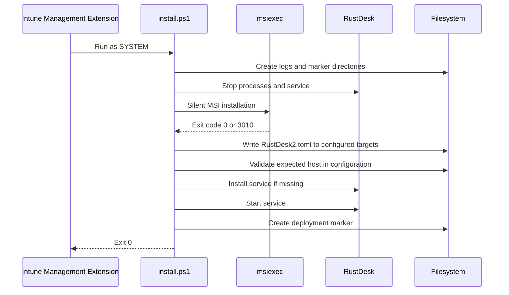

# RustDesk Intune Deployment

[English](README.md) | [Português](README.pt-BR.md)

[](LICENSE)

PowerShell-based deployment package for installing and configuring RustDesk on managed Windows endpoints through Microsoft Intune Win32 applications.

> **Portfolio note:** this project demonstrates endpoint packaging, silent MSI installation, multi-profile configuration, service provisioning, custom Intune detection, operational logging, and staged deployment practices.

> **Sanitization notice:** organization names, server addresses, ports, keys, credentials, tenant information, and other environment-specific values must be replaced before publishing or sharing deployment packages.

<!-- IMAGE PLACEHOLDER: Add a sanitized Microsoft Intune Win32 application overview showing the RustDesk package and assignments. Suggested path: docs/assets/intune-app-overview.png -->

## Overview

RustDesk requires more than installing an MSI when it is deployed as an enterprise remote-support client. The endpoint must also receive the correct self-hosted server configuration, expose that configuration to service and user contexts, start the RustDesk service, and return a reliable detection result to Microsoft Intune.

This repository packages that workflow into three scripts:

| Script | Responsibility |
|---|---|
| `Source/install.ps1` | Installs the MSI, writes `RustDesk2.toml` to machine and user-profile locations, installs or starts the service, logs the operation, and creates a detection marker. |
| `Source/detect.ps1` | Validates that an executable exists, at least one machine-level configuration contains the expected host, and the deployment marker exists. |
| `Source/uninstall.ps1` | Locates an installed RustDesk MSI product and requests a silent uninstall. |

The package is intended for a self-hosted RustDesk deployment, but the configuration model can be adapted to another approved RustDesk service.

## Key Features

- Silent MSI installation through `msiexec`.
- Microsoft Intune Win32 application compatibility.
- Configuration for service, system, default-user, and existing-user contexts.
- Automatic RustDesk service installation when required.
- Dedicated installation and MSI logs.
- Marker-based custom detection.
- Support for reinstall and configuration repair.
- No desktop shortcut and no virtual printer by default.
- Optional permanent-password block disabled by default.
- Separate English and Portuguese operational documentation.

## Architecture



The deployment has two main trust domains:

1. the administrator-controlled package and Intune assignment;
2. the endpoint runtime connecting to the configured RustDesk infrastructure.

See [Architecture](docs/en/ARCHITECTURE.md) for execution contexts, configuration targets, trust boundaries, detection semantics, and known limitations.

## Security Model

The project treats remote-support deployment as a privileged endpoint-management operation:

- installation runs as `SYSTEM` through the Intune Management Extension;
- the MSI must come from a trusted and verified source;
- server values must be reviewed before packaging;
- the RustDesk server **public key** may be deployed to clients, but the server private key must never be included;
- permanent passwords must not be hardcoded into a public repository or broadly shared package;
- deployment should begin with a small pilot ring;
- access to the self-hosted RustDesk infrastructure should be restricted and monitored;
- logs and marker files may reveal internal hostnames and paths and must be sanitized before publication.

> **Important:** the optional permanent-password block in `install.ps1` is disabled. Do not enable it with a shared plaintext password embedded in the script. Prefer a controlled credential-provisioning design with unique or centrally governed credentials.

Review [SECURITY.md](SECURITY.md) before production deployment.

## Repository Structure

```text
RustDeskIntuneDeployment/
|-- Source/
|   |-- install.ps1
|   |-- detect.ps1
|   |-- uninstall.ps1
|   `-- RustDesk.msi          # vendor installer; verify licensing and provenance
|-- Output/                   # generated .intunewin output when retained locally
|-- docs/
|   |-- en/
|   |   |-- ARCHITECTURE.md
|   |   |-- CONFIGURATION.md
|   |   `-- INTUNE.md
|   |-- pt-BR/
|   |   |-- ARCHITECTURE.md
|   |   |-- CONFIGURATION.md
|   |   `-- INTUNE.md
|   `-- assets/
|-- CHANGELOG.md
|-- LICENSE
|-- SECURITY.md
|-- README.md
`-- README.pt-BR.md
```

## Prerequisites

- Microsoft Intune with Win32 application deployment capability.
- Microsoft Intune Management Extension on target devices.
- Supported 64-bit Windows endpoints.
- A trusted RustDesk MSI installer.
- A self-hosted or approved RustDesk service with:
  - server hostname or address;
  - HBBS rendezvous port;
  - HBBR relay port;
  - API port when used;
  - server public key.
- Microsoft Win32 Content Prep Tool (`IntuneWinAppUtil.exe`).
- A representative pilot device group.

## Configure the Package

Edit `Source/install.ps1`:

```powershell
$RustDeskServer   = 'rustdesk.example.internal'
$RustDeskHbbsPort = '21116'
$RustDeskHbbrPort = '21117'
$RustDeskApiPort  = '21114'
$RustDeskKey      = 'SERVER-PUBLIC-KEY'
$OrganizationName = 'orgname'
```

Edit `Source/detect.ps1` with the same host and organization identity:

```powershell
$ExpectedHost     = 'rustdesk.example.internal'
$OrganizationName = 'orgname'
```

The values in the two scripts must remain synchronized. See [Configuration](docs/en/CONFIGURATION.md) for field definitions, data classification, configuration paths, and validation guidance.

## Prepare the Source Directory

Place the trusted RustDesk MSI in `Source/`. The installer currently selects the first file matching `*.msi` in that directory.

Recommended local structure:

```text
Source/
|-- install.ps1
|-- uninstall.ps1
|-- detect.ps1
`-- RustDesk.msi
```

Before packaging:

1. verify the MSI publisher signature;
2. verify the expected RustDesk version;
3. calculate and retain a SHA-256 hash in release records;
4. confirm there is only one intended MSI in the source directory;
5. review the configured server values;
6. confirm the password block remains disabled.

## Build the Intune Package

```powershell
C:\Tools\IntuneWinAppUtil.exe `
    -c .\Source `
    -s install.ps1 `
    -o .\Output `
    -q
```

Upload the resulting `.intunewin` as a Win32 application.

## Recommended Intune Settings

| Field | Value |
|---|---|
| Install command | `powershell.exe -NoProfile -ExecutionPolicy Bypass -File install.ps1` |
| Uninstall command | `powershell.exe -NoProfile -ExecutionPolicy Bypass -File uninstall.ps1` |
| Install behavior | `System` |
| Device restart behavior | `No specific action` |
| Architecture | `64-bit` |
| Detection rule | Custom detection script: `detect.ps1` |
| Run detection as 32-bit | `No` |

The MSI may return `3010`, which the installer accepts as success with restart required. The script itself exits `0` after completing configuration and marker creation.

See [Microsoft Intune Deployment](docs/en/INTUNE.md) for packaging, assignments, pilot criteria, troubleshooting, upgrade, and rollback.

## Installation Flow



The configuration is written to:

- LocalService profile;
- system profile;
- `C:\ProgramData\RustDesk\config`;
- the default user profile;
- existing user profiles discovered through `ProfileList`.

## Detection Semantics

`Source/detect.ps1` returns success only when all three conditions are true:

1. a RustDesk executable exists in a recognized installation path;
2. at least one machine-level `RustDesk2.toml` contains the expected host;
3. the deployment marker exists.

Current detection does **not** fully validate:

- RustDesk service state;
- HBBS, HBBR, or API port values;
- server public-key value;
- every user-profile configuration;
- end-to-end connectivity to the RustDesk server.

Treat Intune detection as package-state detection, not as a complete remote-access health check.

<!-- IMAGE PLACEHOLDER: Add a sanitized Intune detection status or device install status screenshot here. Suggested path: docs/assets/intune-detection-status.png -->

## Logs and Marker

With `OrganizationName = 'orgname'`:

```text
C:\ProgramData\orgname\IntuneLogs\RustDesk-Intune-Install.log
C:\ProgramData\orgname\IntuneMarkers\RustDesk-Configured.marker
C:\ProgramData\Microsoft\IntuneManagementExtension\Logs\RustDesk-msi-install.log
```

The marker records deployment metadata such as server, executable path, version, and validated configuration paths. Protect and sanitize it accordingly.

## Uninstallation

The current `Source/uninstall.ps1` queries `Win32_Product` for a product whose name contains `RustDesk`, then runs a silent MSI uninstall using its product code.

This is functional but has an operational limitation: querying `Win32_Product` can trigger Windows Installer consistency checks for MSI applications. A registry-based product-code lookup is a recommended future hardening improvement.

After uninstalling, validate whether organization-specific logs, markers, and profile configuration files should be retained or removed according to your support and audit requirements. The current uninstall script focuses on removing the MSI product.

## Rollout Strategy


Validate at each stage:

- installation and detection status;
- service startup;
- connection through HBBS and HBBR;
- existing and new user profiles;
- endpoint firewall and proxy behavior;
- unattended-access policy;
- support-team access controls;
- uninstall and rollback.

## Planned Portfolio Assets

The following placeholders remain intentionally empty until sanitized pilot evidence is available:

- Intune Win32 application overview;
- device installation and detection status;
- sanitized RustDesk client using the self-hosted server;
- sanitized installation log or marker sample;
- deployment topology.

Search for `IMAGE PLACEHOLDER` to locate every planned insertion point.

## Disclaimer

This repository contains deployment automation, not the RustDesk application itself. RustDesk, its MSI installer, trademarks, and upstream components are governed by their own licenses and distribution terms.

The MIT license in this repository applies only to the original scripts and documentation authored for this deployment project, unless a file explicitly states otherwise. Verify that any vendor MSI or generated package may be redistributed before committing it to a public repository.

This project must be reviewed and tested against the target Windows, Intune, RustDesk, security, privacy, and compliance environment before production use.

## Documentation

- [Architecture and engineering decisions](docs/en/ARCHITECTURE.md)
- [Configuration reference](docs/en/CONFIGURATION.md)
- [Microsoft Intune deployment](docs/en/INTUNE.md)
- [Documentação em português](README.pt-BR.md)
- [Security Policy](SECURITY.md)
- [Changelog](CHANGELOG.md)

## License

Original deployment scripts and documentation are licensed under the [MIT License](LICENSE).

RustDesk and any bundled vendor installer are licensed separately.

## Author

Developed by [Diogo Wermann](https://github.com/diogowermann) as part of an endpoint management, remote-support, automation, and security portfolio.
