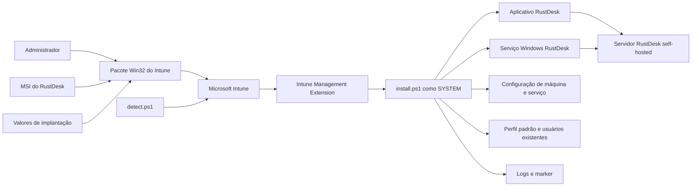
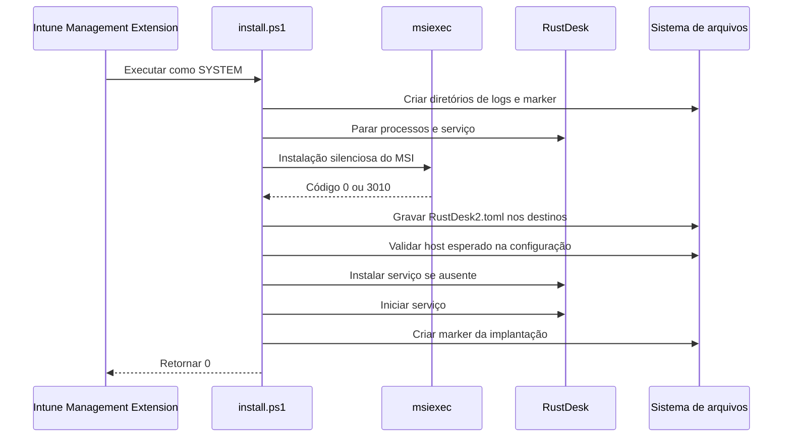

# RustDesk Intune Deployment

[English](README.md) | [Português](README.pt-BR.md)

[](LICENSE)

Pacote de implantação em PowerShell para instalar e configurar o RustDesk em dispositivos Windows gerenciados por meio de aplicativos Win32 do Microsoft Intune.

> **Contexto de portfólio:** este projeto demonstra empacotamento de endpoints, instalação silenciosa por MSI, configuração de múltiplos perfis, provisionamento de serviço, detecção personalizada no Intune, logging operacional e implantação por etapas.

> **Aviso de sanitização:** nomes de organização, servidores, portas, chaves, credenciais, informações de tenant e demais valores específicos do ambiente devem ser substituídos antes da publicação ou do compartilhamento dos pacotes.

<!-- IMAGE PLACEHOLDER: Adicionar uma captura sanitizada da visão geral do aplicativo Win32 no Microsoft Intune, mostrando o pacote RustDesk e suas atribuições. Caminho sugerido: docs/assets/intune-app-overview.png -->

## Visão geral

Implantar o RustDesk como cliente corporativo de suporte remoto exige mais do que instalar um MSI. O endpoint também precisa receber a configuração correta do servidor self-hosted, disponibilizar essa configuração aos contextos de serviço e usuário, iniciar o serviço do RustDesk e retornar um resultado de detecção confiável ao Microsoft Intune.

Este repositório organiza esse fluxo em três scripts:

| Script | Responsabilidade |
|---|---|
| `Source/install.ps1` | Instala o MSI, grava `RustDesk2.toml` em locais de máquina e perfis de usuário, instala ou inicia o serviço, registra logs e cria um marker de detecção. |
| `Source/detect.ps1` | Valida a existência do executável, a presença do host esperado em ao menos uma configuração de máquina e a existência do marker. |
| `Source/uninstall.ps1` | Localiza um produto MSI do RustDesk instalado e solicita sua desinstalação silenciosa. |

O pacote foi projetado para uma implantação self-hosted do RustDesk, mas o modelo de configuração pode ser adaptado a outro serviço RustDesk aprovado.

## Principais recursos

- Instalação silenciosa do MSI por `msiexec`.
- Compatibilidade com aplicativo Win32 do Microsoft Intune.
- Configuração dos contextos de serviço, sistema, usuário padrão e usuários existentes.
- Instalação automática do serviço do RustDesk quando necessário.
- Logs dedicados da instalação e do MSI.
- Detecção personalizada baseada em marker.
- Suporte a reinstalação e reparo de configuração.
- Sem atalho na área de trabalho e sem impressora virtual por padrão.
- Bloco opcional de senha permanente desabilitado por padrão.
- Documentação operacional em inglês e português.

## Arquitetura



A implantação possui dois principais domínios de confiança:

1. o pacote e a atribuição do Intune controlados pelos administradores;
2. o runtime do endpoint conectando-se à infraestrutura RustDesk configurada.

Consulte [Arquitetura](docs/pt-BR/ARCHITECTURE.md) para detalhes sobre contextos de execução, destinos de configuração, limites de confiança, semântica de detecção e limitações conhecidas.

## Modelo de segurança

O projeto trata a implantação de suporte remoto como uma operação privilegiada de gerenciamento de endpoints:

- a instalação executa como `SYSTEM` pela Intune Management Extension;
- o MSI deve vir de uma fonte confiável e verificada;
- os valores do servidor devem ser revisados antes do empacotamento;
- a **chave pública** do servidor RustDesk pode ser distribuída aos clientes, mas a chave privada do servidor nunca deve ser incluída;
- senhas permanentes não devem ser inseridas diretamente em um repositório público ou em um pacote distribuído amplamente;
- a implantação deve começar por um grupo piloto pequeno;
- o acesso à infraestrutura RustDesk self-hosted deve ser restrito e monitorado;
- logs e markers podem revelar hostnames internos e caminhos e devem ser sanitizados antes da publicação.

> **Importante:** o bloco opcional de senha permanente em `install.ps1` está desabilitado. Não o habilite com uma senha compartilhada em texto puro dentro do script. Prefira um desenho controlado de provisionamento de credenciais, com credenciais únicas ou governadas centralmente.

Revise [SECURITY.md](SECURITY.md) antes da implantação em produção.

## Estrutura do repositório

```text
RustDeskIntuneDeployment/
|-- Source/
|   |-- install.ps1
|   |-- detect.ps1
|   |-- uninstall.ps1
|   `-- RustDesk.msi          # instalador de terceiro; validar licença e origem
|-- Output/                   # saída .intunewin gerada, quando mantida localmente
|-- docs/
|   |-- en/
|   |   |-- ARCHITECTURE.md
|   |   |-- CONFIGURATION.md
|   |   `-- INTUNE.md
|   |-- pt-BR/
|   |   |-- ARCHITECTURE.md
|   |   |-- CONFIGURATION.md
|   |   `-- INTUNE.md
|   `-- assets/
|-- CHANGELOG.md
|-- LICENSE
|-- SECURITY.md
|-- README.md
`-- README.pt-BR.md
```

## Pré-requisitos

- Microsoft Intune com capacidade de implantação de aplicativos Win32.
- Microsoft Intune Management Extension nos dispositivos de destino.
- Endpoints Windows de 64 bits suportados.
- Instalador MSI confiável do RustDesk.
- Serviço RustDesk self-hosted ou aprovado com:
  - hostname ou endereço do servidor;
  - porta HBBS de rendezvous;
  - porta HBBR de relay;
  - porta da API, quando utilizada;
  - chave pública do servidor.
- Microsoft Win32 Content Prep Tool (`IntuneWinAppUtil.exe`).
- Grupo piloto representativo.

## Configurar o pacote

Edite `Source/install.ps1`:

```powershell
$RustDeskServer   = 'rustdesk.exemplo.interno'
$RustDeskHbbsPort = '21116'
$RustDeskHbbrPort = '21117'
$RustDeskApiPort  = '21114'
$RustDeskKey      = 'CHAVE-PUBLICA-DO-SERVIDOR'
$OrganizationName = 'orgname'
```

Edite `Source/detect.ps1` com o mesmo host e a mesma identidade da organização:

```powershell
$ExpectedHost     = 'rustdesk.exemplo.interno'
$OrganizationName = 'orgname'
```

Os valores dos dois scripts devem permanecer sincronizados. Consulte [Configuração](docs/pt-BR/CONFIGURATION.md) para definições dos campos, classificação dos dados, caminhos de configuração e orientações de validação.

## Preparar o diretório de origem

Coloque o MSI confiável do RustDesk em `Source/`. Atualmente, o instalador seleciona o primeiro arquivo correspondente a `*.msi` nesse diretório.

Estrutura local recomendada:

```text
Source/
|-- install.ps1
|-- uninstall.ps1
|-- detect.ps1
`-- RustDesk.msi
```

Antes do empacotamento:

1. valide a assinatura do publicador do MSI;
2. confirme a versão esperada do RustDesk;
3. calcule e registre o SHA-256 nos controles da release;
4. confirme que há apenas um MSI destinado à instalação no diretório;
5. revise os valores configurados do servidor;
6. confirme que o bloco de senha permanece desabilitado.

## Gerar o pacote do Intune

```powershell
C:\Tools\IntuneWinAppUtil.exe `
    -c .\Source `
    -s install.ps1 `
    -o .\Output `
    -q
```

Envie o `.intunewin` resultante como aplicativo Win32.

## Configurações recomendadas no Intune

| Campo | Valor |
|---|---|
| Comando de instalação | `powershell.exe -NoProfile -ExecutionPolicy Bypass -File install.ps1` |
| Comando de desinstalação | `powershell.exe -NoProfile -ExecutionPolicy Bypass -File uninstall.ps1` |
| Comportamento da instalação | `System` |
| Reinicialização do dispositivo | `No specific action` |
| Arquitetura | `64-bit` |
| Regra de detecção | Script personalizado: `detect.ps1` |
| Executar detecção em 32 bits | `No` |

O MSI pode retornar `3010`, aceito pelo instalador como sucesso com reinicialização necessária. O script retorna `0` depois de concluir a configuração e criar o marker.

Consulte [Implantação pelo Microsoft Intune](docs/pt-BR/INTUNE.md) para detalhes de empacotamento, atribuições, critérios de piloto, diagnóstico, atualização e rollback.

## Fluxo de instalação



A configuração é gravada em:

- perfil LocalService;
- perfil de sistema;
- `C:\ProgramData\RustDesk\config`;
- perfil de usuário padrão;
- perfis de usuários existentes encontrados por `ProfileList`.

## Semântica da detecção

`Source/detect.ps1` retorna sucesso apenas quando as três condições são verdadeiras:

1. existe um executável do RustDesk em um caminho reconhecido;
2. ao menos um `RustDesk2.toml` de máquina contém o host esperado;
3. o marker da implantação existe.

A detecção atual **não** valida integralmente:

- estado do serviço RustDesk;
- valores das portas HBBS, HBBR e API;
- valor da chave pública do servidor;
- configuração de todos os perfis de usuário;
- conectividade ponta a ponta com o servidor RustDesk.

Considere a detecção do Intune como validação do estado do pacote, não como um health check completo do acesso remoto.

<!-- IMAGE PLACEHOLDER: Adicionar uma captura sanitizada do status de detecção ou instalação dos dispositivos no Intune. Caminho sugerido: docs/assets/intune-detection-status.png -->

## Logs e marker

Com `OrganizationName = 'orgname'`:

```text
C:\ProgramData\orgname\IntuneLogs\RustDesk-Intune-Install.log
C:\ProgramData\orgname\IntuneMarkers\RustDesk-Configured.marker
C:\ProgramData\Microsoft\IntuneManagementExtension\Logs\RustDesk-msi-install.log
```

O marker registra metadados da implantação, como servidor, caminho do executável, versão e configurações validadas. Proteja e sanitize esse conteúdo adequadamente.

## Desinstalação

O `Source/uninstall.ps1` atual consulta `Win32_Product` por um produto cujo nome contém `RustDesk` e solicita uma desinstalação silenciosa pelo ProductCode.

Esse fluxo funciona, mas possui uma limitação operacional: consultas a `Win32_Product` podem disparar verificações de consistência do Windows Installer para aplicativos MSI. Uma descoberta do ProductCode baseada no Registro é uma melhoria futura recomendada.

Depois da desinstalação, valide se logs, markers e arquivos de configuração dos perfis devem ser mantidos ou removidos conforme os requisitos de suporte e auditoria. O script atual é focado na remoção do produto MSI.

## Estratégia de implantação


Valide em cada etapa:

- status de instalação e detecção;
- inicialização do serviço;
- conexão por HBBS e HBBR;
- perfis existentes e novos;
- comportamento de firewall e proxy do endpoint;
- política de acesso não assistido;
- controles de acesso da equipe de suporte;
- desinstalação e rollback.

## Imagens planejadas para o portfólio

Os pontos abaixo permanecem intencionalmente vazios até que existam evidências sanitizadas do piloto:

- visão geral do aplicativo Win32 no Intune;
- status de instalação e detecção dos dispositivos;
- cliente RustDesk sanitizado usando o servidor self-hosted;
- amostra sanitizada do log ou marker;
- topologia da implantação.

Pesquise por `IMAGE PLACEHOLDER` para localizar os pontos de inserção.

## Aviso

Este repositório contém automação de implantação, não o aplicativo RustDesk. O RustDesk, seu instalador MSI, marcas e componentes upstream são regidos por suas próprias licenças e termos de distribuição.

A licença MIT deste repositório se aplica apenas aos scripts e à documentação originais deste projeto de implantação, salvo indicação explícita em contrário. Confirme se o MSI de terceiro ou o pacote gerado podem ser redistribuídos antes de armazená-los em um repositório público.

O projeto deve ser revisado e testado de acordo com o ambiente de Windows, Intune, RustDesk, segurança, privacidade e conformidade antes do uso em produção.

## Documentação

- [Arquitetura e decisões de engenharia](docs/pt-BR/ARCHITECTURE.md)
- [Referência de configuração](docs/pt-BR/CONFIGURATION.md)
- [Implantação pelo Microsoft Intune](docs/pt-BR/INTUNE.md)
- [English documentation](README.md)
- [Política de segurança](SECURITY.md)
- [Changelog](CHANGELOG.md)

## Licença

Os scripts e a documentação originais da implantação estão licenciados sob a [Licença MIT](LICENSE).

O RustDesk e qualquer instalador de terceiro incluído possuem licenciamento separado.

## Autor

Desenvolvido por [Diogo Wermann](https://github.com/diogowermann) como parte de um portfólio de gerenciamento de endpoints, suporte remoto, automação e segurança.
