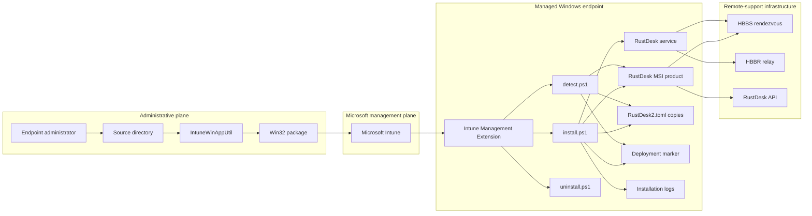
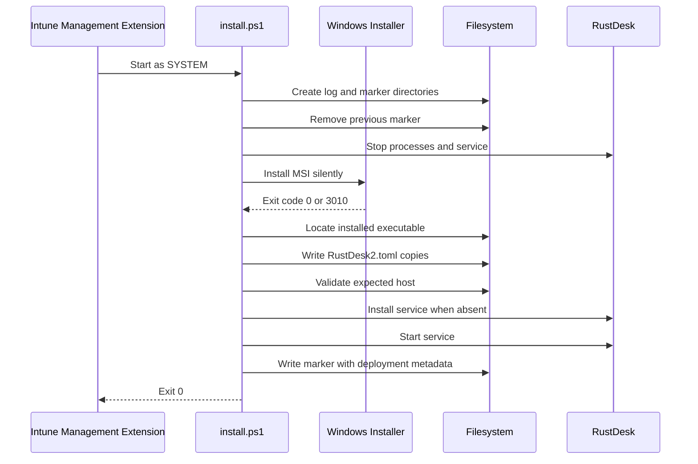
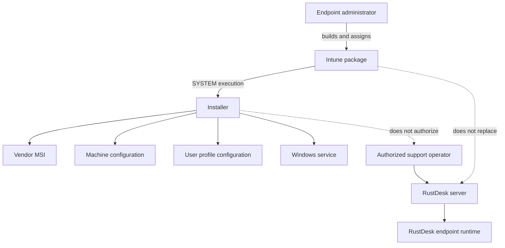
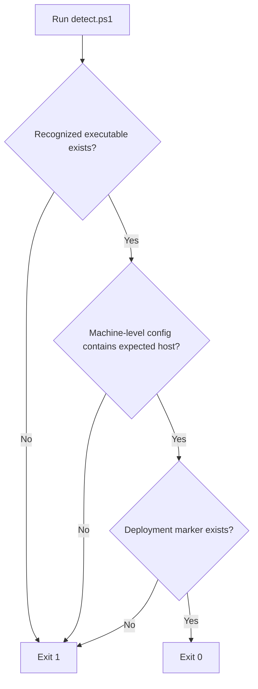
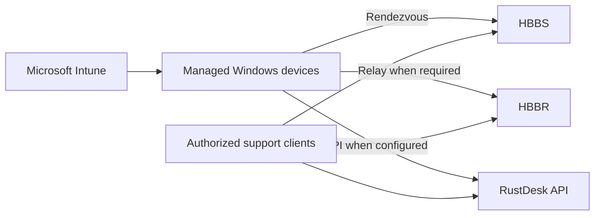

# Architecture

[English](ARCHITECTURE.md) | [Português](../pt-BR/ARCHITECTURE.md)

## Purpose

RustDesk Intune Deployment converts a vendor MSI and environment-specific connection settings into a managed Microsoft Intune Win32 application.

The project is responsible for endpoint deployment and configuration. It is not responsible for operating the HBBS, HBBR, API, web console, identity provider, or network edge of the RustDesk server environment.

## System Context



## Components

### Source package

The `Source/` directory contains the runtime files sent to endpoints:

- `install.ps1`;
- `detect.ps1`;
- `uninstall.ps1`;
- a RustDesk MSI selected by the administrator.

The installer discovers the first `*.msi` file in its working directory. Package hygiene therefore matters: only the intended MSI should be present.

### Microsoft Intune

Intune distributes the `.intunewin`, invokes installation and uninstallation, and evaluates the custom detection script.

Intune is the deployment orchestrator. It does not validate that the configured RustDesk server is healthy or that a remote session can be established.

### Intune Management Extension

The Intune Management Extension executes the install and uninstall commands in the configured context. The recommended deployment uses `System` behavior, giving the installer machine-level access.

### RustDesk application and service

The MSI installs the RustDesk executable. The installer then verifies the executable path and attempts to install the RustDesk service if it is missing.

The service and interactive client may use different Windows profiles, which is why configuration is replicated to multiple locations.

## Installation Sequence



If any required operation throws an exception, the installer records the error and exits `1`. The previous marker is removed before installation to reduce false-positive detection after a failed repair or upgrade.

## Configuration Distribution

The installer writes the same generated `RustDesk2.toml` to several contexts:

| Context | Path category | Reason |
|---|---|---|
| LocalService | `ServiceProfiles\LocalService` | Support service-context reads. |
| System profile | `systemprofile` | Support processes running as `SYSTEM`. |
| ProgramData | `C:\ProgramData\RustDesk\config` | Machine-level shared location. |
| Default user | `C:\Users\Default` | Seed profiles created after deployment. |
| Existing users | Profile paths from `ProfileList` | Configure users who already logged on. |

This is deliberate duplication. RustDesk behavior may vary by installation version and execution context, and one profile cannot be assumed to cover every runtime path.

## Profile Discovery

Existing users are discovered under:

```text
HKLM\SOFTWARE\Microsoft\Windows NT\CurrentVersion\ProfileList
```

The installer expands each profile path and includes conventional `C:\Users\...` profiles while excluding common shared and template profiles.

Operational implications:

- profiles created after installation inherit the default-user copy;
- existing profiles receive a direct copy;
- nonstandard profile locations may require testing;
- offline or inaccessible profiles can cause deployment differences;
- later manual changes are not continuously reconciled by this package.

## Privilege Boundaries



Deployment authorization and remote-support authorization are separate concerns. Successfully installing the client does not define who may access devices. Server-side user, role, audit, MFA, and access policies remain essential.

## Trust Boundaries

### Vendor binary boundary

The MSI is third-party code executed with high privileges. Its provenance, signature, version, hash, license, and redistribution terms must be validated independently.

### Package configuration boundary

The source scripts contain environment-specific values. Anyone able to modify the package can redirect clients to another server or alter endpoint behavior.

### Server identity boundary

The client configuration includes the RustDesk server public key. The corresponding private key belongs only on the server infrastructure and must never be packaged.

### Endpoint filesystem boundary

Configuration copies, logs, and marker files are local artifacts. They may reveal internal infrastructure metadata and must be protected according to the organization's endpoint policy.

### Remote-access boundary

RustDesk permits interactive remote control. Access governance must be implemented on the server and support-operational layers, not assumed from Intune assignment alone.

## Detection Architecture



Detection intentionally checks package state, but it is narrower than a health probe.

It confirms:

- executable presence;
- an expected-host string in one of three machine-level configuration files;
- marker presence.

It does not confirm:

- Windows service existence or running state;
- configured ports;
- configured public key;
- every copied user configuration;
- server reachability;
- authenticated remote-session success;
- support-operator authorization.

## Marker and Logging

The installation transcript is written under the organization-specific `IntuneLogs` directory. The MSI verbose log is written under the Intune Management Extension log directory.

The marker is created only after installation, configuration validation, service verification, and metadata collection complete.

The marker includes:

- deployment timestamp;
- configured server;
- executable path;
- detected version;
- validation result;
- list of configuration files containing the expected host.

The marker is evidence of installer completion, not cryptographic attestation.

## Failure Behavior

| Failure | Current behavior |
|---|---|
| MSI missing | Installation fails before MSI execution. |
| MSI returns unexpected code | Installation fails. |
| Executable not found | Installation fails. |
| No configuration contains expected host | Installation fails. |
| Service cannot be confirmed | Installation fails. |
| Marker cannot be written | Installation fails. |
| Optional password block disabled | No permanent password is configured by this block. |
| Detection condition missing | Detection exits `1`; Intune may retry according to assignment behavior. |

## Uninstallation Architecture

The current uninstall script:

1. queries `Win32_Product`;
2. selects the first product with a name matching `*RustDesk*`;
3. runs `msiexec /x` with the product code;
4. exits `0`.

Known limitations:

- `Win32_Product` can trigger MSI consistency checks;
- matching by display name may select an unintended RustDesk-related product;
- exit code from `msiexec` is not explicitly validated;
- organization logs and markers are not removed;
- copied profile configuration is not removed;
- server-side device records are not cleaned up.

A future hardening version should use uninstall registry keys, validate exit codes, and define explicit artifact-retention behavior.

## Engineering Decisions

### Multi-profile configuration

Chosen to support the service, system, machine, existing-user, and future-user contexts without requiring a separate logon remediation script.

### Marker-based detection

Chosen to avoid reporting success based only on executable presence. The marker indicates that the custom configuration workflow reached its final stage.

### Separate MSI log and PowerShell transcript

Chosen to separate Windows Installer details from orchestration and configuration details.

### Password configuration disabled

Chosen because a shared permanent password embedded in a package would create a broad credential exposure risk.

### No continuous remediation

The current project is an application deployment package, not a scheduled compliance agent. After successful installation, Intune detection can trigger reinstall when the checked conditions fail, but it does not continuously compare the complete configuration.

## Deployment Topology



<!-- IMAGE PLACEHOLDER: Add a sanitized production deployment topology with Intune, endpoints, HBBS, HBBR, API, firewall boundaries, and support operators. Suggested path: ../assets/deployment-topology.png -->

## Related Documentation

- [Configuration](CONFIGURATION.md)
- [Microsoft Intune Deployment](INTUNE.md)
- [Security Policy](../../SECURITY.md)
