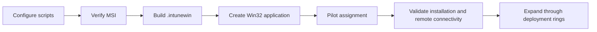
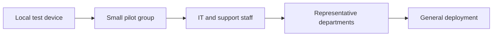

# Microsoft Intune Deployment

[English](INTUNE.md) | [Português](../pt-BR/INTUNE.md)

## Deployment Model

RustDesk Intune Deployment is packaged as a Microsoft Intune Win32 application. The package installs the RustDesk MSI, writes the self-hosted server configuration, starts the Windows service, and creates the artifacts used by the custom detection script.



## Prerequisites

- Microsoft Intune licensing and administrative access.
- Intune Management Extension available on target devices.
- Supported Windows endpoints.
- Self-hosted or approved RustDesk infrastructure.
- Trusted RustDesk MSI.
- Microsoft Win32 Content Prep Tool.
- Sanitized and synchronized `install.ps1` and `detect.ps1` values.
- Pilot group containing representative devices.
- Approved remote-support security and privacy policy.

## Prepare the Source

Expected directory:

```text
Source/
|-- install.ps1
|-- uninstall.ps1
|-- detect.ps1
`-- RustDesk.msi
```

The installer selects the first `*.msi` file. Remove old or unrelated MSI files before building.

Verify the package source:

```powershell
Get-AuthenticodeSignature .\Source\RustDesk.msi
Get-FileHash .\Source\RustDesk.msi -Algorithm SHA256
```

Record the MSI version and hash in the change or release record.

## Review Configuration

Confirm `Source/install.ps1` contains the intended:

- RustDesk server;
- HBBS port;
- HBBR port;
- API port;
- server public key;
- organization name.

Confirm `Source/detect.ps1` contains the same server host and organization name.

Review the generated TOML structure in [Configuration](CONFIGURATION.md).

## Build the Package

```powershell
C:\Tools\IntuneWinAppUtil.exe `
    -c .\Source `
    -s install.ps1 `
    -o .\Output `
    -q
```

The output directory will contain the generated `.intunewin`.

Do not treat `.intunewin` as secret storage. Authorized administrators can recover packaged content. Never include private keys or passwords.

## Create the Win32 Application

Recommended application information:

| Property | Recommended value |
|---|---|
| Name | `RustDesk - Managed Deployment` |
| Description | Self-hosted RustDesk client deployed and configured through Intune |
| Publisher | Your organization |
| App version | RustDesk MSI version plus deployment revision |
| Category | Remote support / Endpoint management |
| Information URL | Internal support page or this repository |
| Privacy URL | Organization remote-support privacy policy |

<!-- IMAGE PLACEHOLDER: Add a sanitized Intune App information screen showing name, description, publisher, version, and owner. Suggested path: ../assets/intune-app-information.png -->

## Program Settings

| Field | Value |
|---|---|
| Install command | `powershell.exe -NoLogo -NoProfile -NonInteractive -ExecutionPolicy Bypass -File install.ps1` |
| Uninstall command | `powershell.exe -NoLogo -NoProfile -NonInteractive -ExecutionPolicy Bypass -File uninstall.ps1` |
| Install behavior | `System` |
| Device restart behavior | `No specific action` |
| Return code `0` | Success |
| Return code `1` | Failed |

The internal MSI installer accepts MSI exit codes `0` and `3010`. The PowerShell script returns `0` after completing the full custom workflow.

## Requirements

Recommended baseline:

| Field | Recommendation |
|---|---|
| Operating system architecture | 64-bit |
| Minimum operating system | Your supported Windows 10/11 baseline |
| Disk space | Allow for MSI, application files, logs, and copied configuration |
| Network | Required access to HBBS, HBBR, and API paths |

Use additional requirement rules when only a subset of devices should receive remote-support software.

## Detection Rule

Select **Use a custom detection script** and upload:

```text
Source\detect.ps1
```

Configure:

| Setting | Value |
|---|---|
| Run script as 32-bit process on 64-bit clients | `No` |
| Enforce script signature check | `No` until scripts are signed |

The detection succeeds when:

- a recognized RustDesk executable exists;
- at least one machine-level configuration contains the expected host;
- the organization-specific marker exists.

It does not validate complete server connectivity. See [Architecture](ARCHITECTURE.md#detection-architecture).

## Dependencies

The deployment normally has no Intune Win32 application dependency beyond the supported Windows environment.

Possible organizational dependencies include:

- endpoint firewall policy;
- trusted certificate deployment for HTTPS endpoints;
- VPN or network routes;
- server-side RustDesk accounts and roles;
- prerequisite security baselines;
- removal of conflicting remote-support tools.

Model these as dependencies only when the order must be enforced by Intune.

## Assignment Rings



### Pilot device selection

Include devices representing:

- Windows versions and editions in scope;
- laptops and desktops;
- office, VPN, and remote networks;
- standard users without local administrator rights;
- existing user profiles and newly created profiles;
- devices subject to endpoint firewall and security policies;
- different physical locations when latency or NAT behavior differs.

### Pilot success criteria

Proceed only after confirming:

- Intune installation reports success;
- detection reports installed;
- RustDesk service exists and starts;
- the expected configuration exists in machine contexts;
- existing user profiles received configuration;
- new profiles inherit configuration;
- clients reach HBBS;
- relay works through HBBR when direct connectivity is unavailable;
- support operators authenticate through approved controls;
- logs contain no unexpected secrets;
- uninstall and rollback have been tested.

## Validation on a Pilot Device

Inspect Intune deployment artifacts:

```powershell
Get-Content 'C:\ProgramData\orgname\IntuneLogs\RustDesk-Intune-Install.log' -Tail 100
Get-Content 'C:\ProgramData\Microsoft\IntuneManagementExtension\Logs\RustDesk-msi-install.log' -Tail 100
Get-Content 'C:\ProgramData\orgname\IntuneMarkers\RustDesk-Configured.marker'
```

Inspect the service:

```powershell
Get-Service -Name RustDesk
Get-CimInstance Win32_Service -Filter "Name='RustDesk'" |
    Select-Object Name, State, StartMode, StartName, PathName
```

Inspect machine configurations:

```powershell
$paths = @(
    'C:\Windows\ServiceProfiles\LocalService\AppData\Roaming\RustDesk\config\RustDesk2.toml',
    'C:\Windows\System32\config\systemprofile\AppData\Roaming\RustDesk\config\RustDesk2.toml',
    'C:\ProgramData\RustDesk\config\RustDesk2.toml'
)

$paths | ForEach-Object {
    [pscustomobject]@{
        Path = $_
        Exists = Test-Path $_
    }
}
```

Do not paste unsanitized configuration content into public issues or screenshots.

<!-- IMAGE PLACEHOLDER: Add a sanitized Intune Device install status view from the pilot assignment. Suggested path: ../assets/intune-pilot-status.png -->

## Network Validation

Validate connectivity according to the actual topology:

```powershell
Test-NetConnection rustdesk.example.internal -Port 21116
Test-NetConnection rustdesk.example.internal -Port 21117
Test-NetConnection rustdesk.example.internal -Port 21114
```

A successful TCP test does not prove application-level authentication or relay behavior. Perform a controlled support session from an authorized operator account.

## Troubleshooting

### Package installation fails

Review:

- `AgentExecutor.log` and other Intune Management Extension logs;
- organization-specific transcript;
- verbose MSI log;
- MSI signature and architecture;
- source directory contents;
- Windows Installer exit code;
- service installation step;
- permissions to create profile configuration directories.

### Installed but not detected

Check:

- `$ExpectedHost` equals `$RustDeskServer`;
- `$OrganizationName` is identical in both scripts;
- marker exists at the expected path;
- executable exists in a recognized path;
- one machine configuration contains the expected host;
- detection runs as 64-bit.

### Service is missing

Check:

- RustDesk executable path;
- install transcript around `--install-service`;
- Windows service-control events;
- endpoint security software blocking service creation;
- compatibility of the selected RustDesk MSI version.

### Client does not reach the server

Check:

- DNS resolution;
- HBBS and HBBR firewall rules;
- proxy and VPN routing;
- NAT behavior;
- public-key value;
- server services and logs;
- client configuration and version compatibility.

### Existing users work but new users do not

Validate the copy under `C:\Users\Default`. Confirm profile creation does not overwrite the seeded configuration.

### New users work but an existing user does not

Inspect that user's `AppData\Roaming\RustDesk\config\RustDesk2.toml`, profile permissions, and whether RustDesk rewrote the file after deployment.

## Upgrade Procedure

1. obtain and verify the new RustDesk MSI;
2. record version and SHA-256;
3. replace the old MSI in `Source/`;
4. review configuration compatibility;
5. rebuild `.intunewin`;
6. update the Intune application or create a superseding application;
7. deploy to the pilot group;
8. validate reinstall, service state, configurations, marker, and detection;
9. expand through rings.

The installer removes the previous marker before reinstalling, stops RustDesk, installs the MSI, rewrites configuration, and recreates the marker.

## Supersedence

Two patterns are possible:

### Update the existing application

Replace package content and application version while preserving assignments and reporting history.

### Create a new application

Create a new Win32 application and supersede the previous version. This improves release-level visibility and controlled rollback.

Test whether uninstalling the superseded package is appropriate. The installer is designed to reinstall or upgrade in place, so forced uninstall may be unnecessary and more disruptive.

## Rollback

Rollback requires both package and infrastructure compatibility.

Recommended process:

1. retain the previous verified MSI and source package outside the public repository;
2. rebuild or retain the previous `.intunewin` and matching detection script;
3. reassign it to pilot devices;
4. confirm the older client remains compatible with the server;
5. verify configuration format and service behavior;
6. expand only after successful validation.

## Uninstallation Validation

The current uninstaller removes the MSI product but does not explicitly clean every deployment artifact.

After uninstall, inspect:

- RustDesk executable and service;
- organization marker;
- organization installation log;
- machine-level configurations;
- default-user configuration;
- existing-user configurations;
- server-side device inventory or address book records.

Define retention and cleanup requirements before broad removal.

## Production Readiness Checklist

- [ ] Source values are synchronized and sanitized.
- [ ] MSI signature is valid.
- [ ] MSI SHA-256 is recorded.
- [ ] Vendor license and redistribution terms were reviewed.
- [ ] No private key or password is packaged.
- [ ] Password block is disabled.
- [ ] Intune install behavior is `System`.
- [ ] Detection runs as 64-bit.
- [ ] Pilot group is assigned.
- [ ] HBBS, HBBR, and API network paths are tested.
- [ ] Server-side access control and audit are configured.
- [ ] Existing and new profiles are validated.
- [ ] Upgrade is tested.
- [ ] Uninstall is tested.
- [ ] Rollback package is available.
- [ ] Support documentation and incident process are defined.

## Related Documentation

- [Architecture](ARCHITECTURE.md)
- [Configuration](CONFIGURATION.md)
- [Security Policy](../../SECURITY.md)
