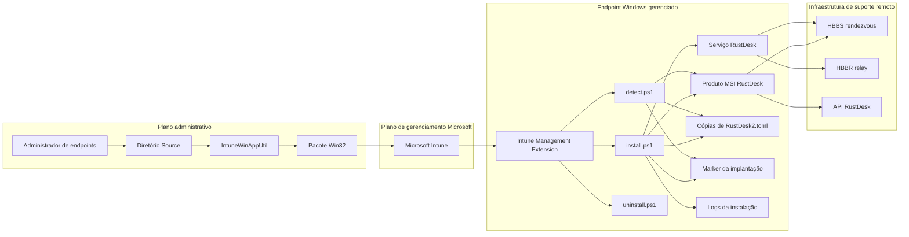
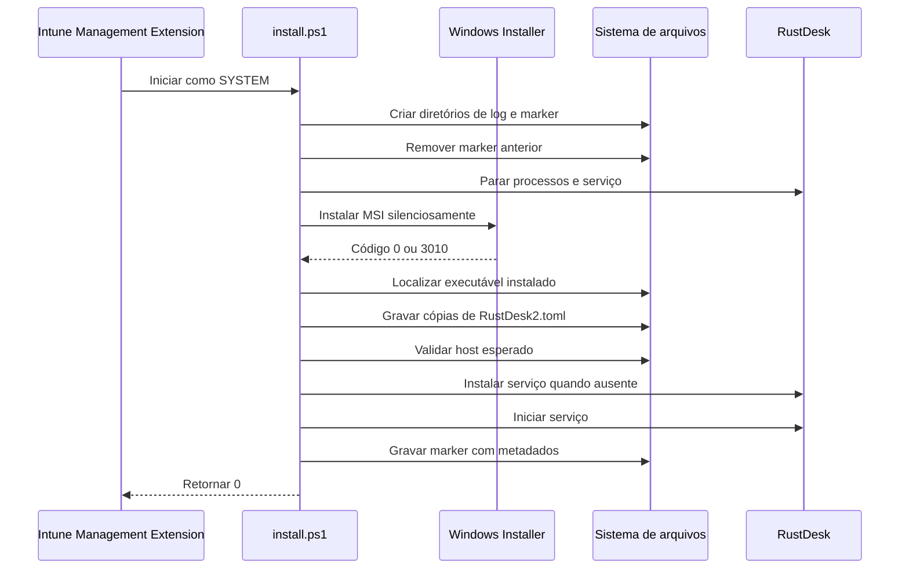
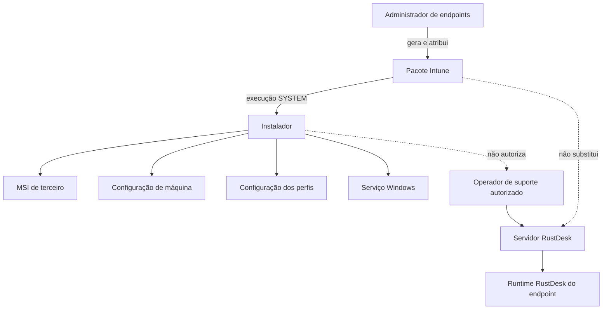
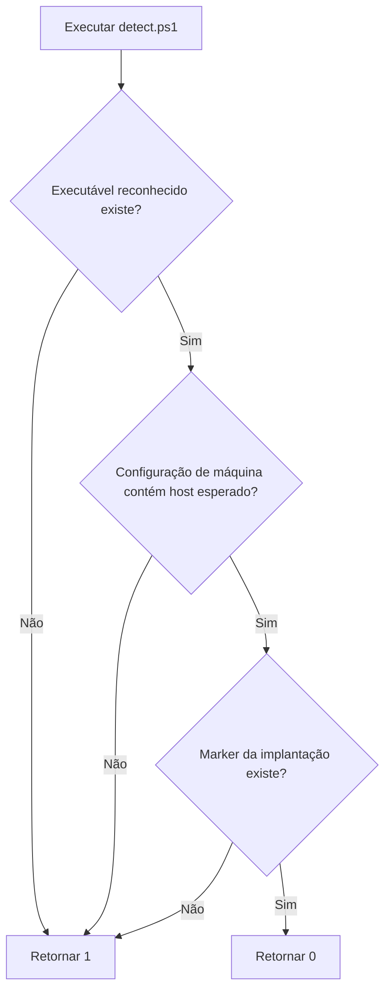
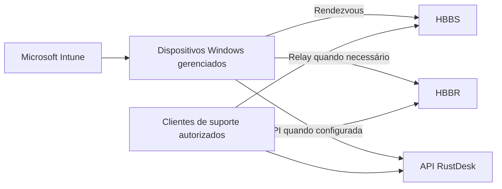

# Arquitetura

[English](../en/ARCHITECTURE.md) | [Português](ARCHITECTURE.md)

## Objetivo

O RustDesk Intune Deployment transforma um MSI de terceiro e configurações específicas do ambiente em um aplicativo Win32 gerenciado pelo Microsoft Intune.

O projeto é responsável pela implantação e configuração nos endpoints. Ele não é responsável pela operação dos componentes HBBS, HBBR, API, console web, provedor de identidade ou perímetro de rede do ambiente RustDesk.

## Contexto do sistema



## Componentes

### Pacote de origem

O diretório `Source/` contém os arquivos de runtime enviados aos endpoints:

- `install.ps1`;
- `detect.ps1`;
- `uninstall.ps1`;
- um MSI do RustDesk selecionado pelo administrador.

O instalador encontra o primeiro arquivo `*.msi` no diretório de trabalho. Portanto, o pacote deve conter apenas o MSI correto.

### Microsoft Intune

O Intune distribui o `.intunewin`, invoca instalação e desinstalação e avalia o script personalizado de detecção.

O Intune é o orquestrador da implantação. Ele não valida se o servidor RustDesk está saudável nem se uma sessão remota pode ser estabelecida.

### Intune Management Extension

A Intune Management Extension executa os comandos de instalação e desinstalação no contexto configurado. A implantação recomendada utiliza comportamento `System`, concedendo acesso de máquina ao instalador.

### Aplicativo e serviço RustDesk

O MSI instala o executável do RustDesk. Em seguida, o instalador valida o caminho do executável e tenta instalar o serviço do RustDesk se ele estiver ausente.

Serviço e cliente interativo podem utilizar perfis Windows distintos, motivo pelo qual a configuração é replicada em múltiplos locais.

## Sequência de instalação



Se uma operação obrigatória gerar exceção, o instalador registra o erro e retorna `1`. O marker anterior é removido antes da instalação para reduzir falsos positivos após reparo ou atualização com falha.

## Distribuição da configuração

O instalador grava o mesmo `RustDesk2.toml` nos seguintes contextos:

| Contexto | Categoria de caminho | Motivo |
|---|---|---|
| LocalService | `ServiceProfiles\LocalService` | Suportar leituras no contexto do serviço. |
| Perfil de sistema | `systemprofile` | Suportar processos executando como `SYSTEM`. |
| ProgramData | `C:\ProgramData\RustDesk\config` | Local compartilhado de máquina. |
| Usuário padrão | `C:\Users\Default` | Preparar perfis criados após a implantação. |
| Usuários existentes | Caminhos obtidos em `ProfileList` | Configurar usuários que já efetuaram logon. |

Essa duplicação é intencional. O comportamento do RustDesk pode variar conforme versão e contexto de execução, e um único perfil não deve ser presumido como suficiente.

## Descoberta de perfis

Usuários existentes são encontrados em:

```text
HKLM\SOFTWARE\Microsoft\Windows NT\CurrentVersion\ProfileList
```

O instalador expande cada caminho e inclui perfis convencionais em `C:\Users\...`, excluindo perfis compartilhados e de modelo conhecidos.

Implicações operacionais:

- perfis criados depois da instalação recebem a cópia do usuário padrão;
- perfis existentes recebem uma cópia direta;
- locais de perfil não convencionais devem ser testados;
- perfis inacessíveis podem apresentar diferenças;
- alterações manuais posteriores não são reconciliadas continuamente pelo pacote.

## Limites de privilégio



Autorização de implantação e autorização de suporte remoto são preocupações separadas. Instalar o cliente com sucesso não define quem pode acessar os dispositivos. Políticas de usuário, função, auditoria, MFA e acesso no servidor continuam essenciais.

## Limites de confiança

### Binário do fornecedor

O MSI é código de terceiro executado com privilégios elevados. Origem, assinatura, versão, hash, licença e termos de redistribuição devem ser validados independentemente.

### Configuração do pacote

Os scripts contêm valores do ambiente. Quem puder modificar o pacote pode redirecionar os clientes ou alterar o comportamento dos endpoints.

### Identidade do servidor

A configuração inclui a chave pública do servidor RustDesk. A chave privada correspondente deve permanecer exclusivamente na infraestrutura do servidor.

### Sistema de arquivos do endpoint

Configurações, logs e marker são artefatos locais que podem revelar metadados internos. Eles devem ser protegidos conforme a política corporativa de endpoints.

### Acesso remoto

O RustDesk permite controle remoto interativo. A governança de acesso deve ser aplicada no servidor e nos processos de suporte, não inferida apenas pela atribuição do Intune.

## Arquitetura da detecção



A detecção confirma:

- presença do executável;
- texto do host esperado em uma das três configurações de máquina;
- presença do marker.

Ela não confirma:

- existência ou estado do serviço Windows;
- portas configuradas;
- chave pública configurada;
- todas as cópias dos perfis de usuário;
- alcance do servidor;
- sucesso de sessão remota autenticada;
- autorização do operador de suporte.

## Marker e logging

O transcript da instalação é gravado no diretório `IntuneLogs` da organização. O log detalhado do MSI é gravado no diretório de logs da Intune Management Extension.

O marker é criado somente depois de a instalação, validação da configuração, verificação do serviço e coleta de metadados serem concluídas.

O marker inclui:

- data e hora da implantação;
- servidor configurado;
- caminho do executável;
- versão detectada;
- resultado da validação;
- lista de arquivos de configuração contendo o host esperado.

O marker é evidência da conclusão do instalador, não uma atestação criptográfica.

## Comportamento em falhas

| Falha | Comportamento atual |
|---|---|
| MSI ausente | Instalação falha antes da execução do MSI. |
| MSI retorna código inesperado | Instalação falha. |
| Executável não encontrado | Instalação falha. |
| Nenhuma configuração contém o host | Instalação falha. |
| Serviço não pode ser confirmado | Instalação falha. |
| Marker não pode ser gravado | Instalação falha. |
| Bloco de senha desabilitado | Nenhuma senha permanente é configurada pelo bloco. |
| Condição de detecção ausente | Detecção retorna `1`; o Intune pode tentar novamente conforme a atribuição. |

## Arquitetura da desinstalação

O script atual:

1. consulta `Win32_Product`;
2. seleciona o primeiro produto com nome correspondente a `*RustDesk*`;
3. executa `msiexec /x` com o ProductCode;
4. retorna `0`.

Limitações conhecidas:

- `Win32_Product` pode disparar verificações de consistência do MSI;
- a correspondência pelo nome pode selecionar produto relacionado inesperado;
- o código de saída do `msiexec` não é validado explicitamente;
- logs e markers da organização não são removidos;
- configurações copiadas aos perfis não são removidas;
- registros de dispositivo no servidor não são limpos.

Uma versão futura deve usar as chaves de desinstalação do Registro, validar códigos de saída e definir explicitamente a retenção dos artefatos.

## Decisões de engenharia

### Configuração em múltiplos perfis

Escolhida para atender serviço, sistema, máquina, usuários existentes e usuários futuros sem exigir script separado de remediação no logon.

### Detecção com marker

Escolhida para não reportar sucesso apenas pela presença do executável. O marker indica que o fluxo personalizado chegou à etapa final.

### Logs separados do MSI e PowerShell

Escolhidos para separar detalhes do Windows Installer dos detalhes de orquestração e configuração.

### Configuração de senha desabilitada

Escolhida porque uma senha permanente compartilhada dentro do pacote criaria amplo risco de exposição de credenciais.

### Sem remediação contínua

O projeto atual é um pacote de implantação, não um agente de conformidade agendado. A detecção pode provocar reinstalação quando suas condições falham, mas não compara continuamente a configuração completa.

## Topologia da implantação



<!-- IMAGE PLACEHOLDER: Adicionar uma topologia sanitizada de produção com Intune, endpoints, HBBS, HBBR, API, limites de firewall e operadores de suporte. Caminho sugerido: ../assets/deployment-topology.png -->

## Documentação relacionada

- [Configuração](CONFIGURATION.md)
- [Implantação pelo Microsoft Intune](INTUNE.md)
- [Política de segurança](../../SECURITY.md)
