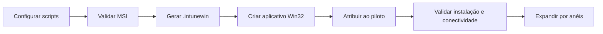
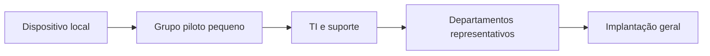

# Implantação pelo Microsoft Intune

[English](../en/INTUNE.md) | [Português](INTUNE.md)

## Modelo de implantação

O RustDesk Intune Deployment é empacotado como aplicativo Win32 do Microsoft Intune. O pacote instala o MSI do RustDesk, grava a configuração do servidor self-hosted, inicia o serviço Windows e cria os artefatos utilizados pelo script personalizado de detecção.



## Pré-requisitos

- Licenciamento e acesso administrativo ao Microsoft Intune.
- Intune Management Extension disponível nos dispositivos.
- Endpoints Windows suportados.
- Infraestrutura RustDesk self-hosted ou aprovada.
- MSI confiável do RustDesk.
- Microsoft Win32 Content Prep Tool.
- Valores sanitizados e sincronizados em `install.ps1` e `detect.ps1`.
- Grupo piloto representativo.
- Política aprovada de segurança e privacidade para suporte remoto.

## Preparar a origem

Estrutura esperada:

```text
Source/
|-- install.ps1
|-- uninstall.ps1
|-- detect.ps1
`-- RustDesk.msi
```

O instalador seleciona o primeiro `*.msi`. Remova MSIs antigos ou não relacionados antes do build.

Valide a origem:

```powershell
Get-AuthenticodeSignature .\Source\RustDesk.msi
Get-FileHash .\Source\RustDesk.msi -Algorithm SHA256
```

Registre a versão e o hash do MSI no controle de mudança ou release.

## Revisar a configuração

Confirme em `Source/install.ps1`:

- servidor RustDesk;
- porta HBBS;
- porta HBBR;
- porta da API;
- chave pública do servidor;
- nome da organização.

Confirme em `Source/detect.ps1` o mesmo host e o mesmo nome da organização.

Revise a estrutura do TOML em [Configuração](CONFIGURATION.md).

## Gerar o pacote

```powershell
C:\Tools\IntuneWinAppUtil.exe `
    -c .\Source `
    -s install.ps1 `
    -o .\Output `
    -q
```

O diretório de saída conterá o `.intunewin`.

Não trate `.intunewin` como armazenamento secreto. Administradores autorizados podem recuperar o conteúdo empacotado. Nunca inclua chaves privadas ou senhas.

## Criar o aplicativo Win32

Informações recomendadas:

| Propriedade | Valor recomendado |
|---|---|
| Nome | `RustDesk - Managed Deployment` |
| Descrição | Cliente RustDesk self-hosted implantado e configurado pelo Intune |
| Publicador | Sua organização |
| Versão | Versão do MSI mais revisão da implantação |
| Categoria | Suporte remoto / Gerenciamento de endpoints |
| URL de informações | Página interna de suporte ou este repositório |
| URL de privacidade | Política corporativa de suporte remoto |

<!-- IMAGE PLACEHOLDER: Adicionar uma captura sanitizada da tela de informações do aplicativo no Intune. Caminho sugerido: ../assets/intune-app-information.png -->

## Configurações do programa

| Campo | Valor |
|---|---|
| Instalação | `powershell.exe -NoLogo -NoProfile -NonInteractive -ExecutionPolicy Bypass -File install.ps1` |
| Desinstalação | `powershell.exe -NoLogo -NoProfile -NonInteractive -ExecutionPolicy Bypass -File uninstall.ps1` |
| Comportamento | `System` |
| Reinicialização | `No specific action` |
| Código `0` | Sucesso |
| Código `1` | Falha |

O instalador interno aceita os códigos MSI `0` e `3010`. O script PowerShell retorna `0` após concluir todo o fluxo personalizado.

## Requisitos

Baseline recomendado:

| Campo | Recomendação |
|---|---|
| Arquitetura | 64 bits |
| Sistema mínimo | Baseline suportado de Windows 10/11 |
| Espaço em disco | MSI, aplicação, logs e configurações copiadas |
| Rede | Acesso necessário a HBBS, HBBR e API |

Use regras adicionais quando apenas um subconjunto de dispositivos deve receber software de suporte remoto.

## Regra de detecção

Selecione **Use a custom detection script** e envie:

```text
Source\detect.ps1
```

Configure:

| Opção | Valor |
|---|---|
| Executar em processo 32-bit em clientes 64-bit | `No` |
| Exigir assinatura do script | `No` enquanto os scripts não forem assinados |

A detecção tem sucesso quando:

- existe um executável reconhecido do RustDesk;
- ao menos uma configuração de máquina contém o host esperado;
- existe o marker da organização.

Ela não valida a conectividade completa com o servidor. Consulte [Arquitetura](ARCHITECTURE.md#arquitetura-da-detecção).

## Dependências

A implantação normalmente não possui dependência de outro aplicativo Win32 além do ambiente Windows suportado.

Dependências organizacionais possíveis:

- política de firewall do endpoint;
- certificados confiáveis para endpoints HTTPS;
- VPN ou rotas de rede;
- contas e funções no servidor RustDesk;
- baselines de segurança;
- remoção de ferramentas conflitantes de suporte remoto.

Modele como dependência no Intune somente quando a ordem precisar ser imposta.

## Anéis de implantação



### Seleção do piloto

Inclua dispositivos representando:

- versões e edições do Windows no escopo;
- notebooks e desktops;
- redes do escritório, VPN e remotas;
- usuários padrão sem administrador local;
- perfis existentes e perfis novos;
- políticas de firewall e segurança relevantes;
- diferentes locais físicos quando NAT ou latência variarem.

### Critérios de sucesso

Avance somente depois de confirmar:

- instalação com sucesso no Intune;
- detecção como instalada;
- serviço RustDesk criado e iniciado;
- configuração esperada nos contextos de máquina;
- configuração nos perfis existentes;
- herança da configuração em novos perfis;
- acesso ao HBBS;
- funcionamento do relay pelo HBBR;
- autenticação dos operadores por controles aprovados;
- ausência de segredos inesperados nos logs;
- desinstalação e rollback testados.

## Validação em um dispositivo piloto

Inspecione os artefatos:

```powershell
Get-Content 'C:\ProgramData\orgname\IntuneLogs\RustDesk-Intune-Install.log' -Tail 100
Get-Content 'C:\ProgramData\Microsoft\IntuneManagementExtension\Logs\RustDesk-msi-install.log' -Tail 100
Get-Content 'C:\ProgramData\orgname\IntuneMarkers\RustDesk-Configured.marker'
```

Inspecione o serviço:

```powershell
Get-Service -Name RustDesk
Get-CimInstance Win32_Service -Filter "Name='RustDesk'" |
    Select-Object Name, State, StartMode, StartName, PathName
```

Inspecione as configurações de máquina:

```powershell
$paths = @(
    'C:\Windows\ServiceProfiles\LocalService\AppData\Roaming\RustDesk\config\RustDesk2.toml',
    'C:\Windows\System32\config\systemprofile\AppData\Roaming\RustDesk\config\RustDesk2.toml',
    'C:\ProgramData\RustDesk\config\RustDesk2.toml'
)

$paths | ForEach-Object {
    [pscustomobject]@{
        Path = $_
        Exists = Test-Path $_
    }
}
```

Não publique configurações não sanitizadas em issues ou capturas.

<!-- IMAGE PLACEHOLDER: Adicionar uma captura sanitizada do status de instalação dos dispositivos no piloto. Caminho sugerido: ../assets/intune-pilot-status.png -->

## Validação de rede

```powershell
Test-NetConnection rustdesk.exemplo.interno -Port 21116
Test-NetConnection rustdesk.exemplo.interno -Port 21117
Test-NetConnection rustdesk.exemplo.interno -Port 21114
```

Um teste TCP bem-sucedido não comprova autenticação ou comportamento de relay. Execute uma sessão controlada usando uma conta autorizada.

## Diagnóstico

### Instalação do pacote falha

Revise:

- `AgentExecutor.log` e logs da Intune Management Extension;
- transcript da organização;
- log detalhado do MSI;
- assinatura e arquitetura do MSI;
- conteúdo do diretório `Source`;
- código de saída do Windows Installer;
- etapa de criação do serviço;
- permissões para criar configurações nos perfis.

### Instalado, mas não detectado

Verifique:

- `$ExpectedHost` igual a `$RustDeskServer`;
- `$OrganizationName` igual nos dois scripts;
- marker no caminho esperado;
- executável em caminho reconhecido;
- host presente em uma configuração de máquina;
- execução da detecção em 64 bits.

### Serviço ausente

Verifique:

- caminho do executável;
- transcript na etapa `--install-service`;
- eventos do Service Control Manager;
- bloqueio por software de segurança;
- compatibilidade da versão do MSI.

### Cliente não alcança o servidor

Verifique:

- resolução DNS;
- firewall de HBBS e HBBR;
- proxy, VPN e rotas;
- comportamento de NAT;
- chave pública;
- serviços e logs do servidor;
- compatibilidade entre versões.

### Usuários existentes funcionam, mas novos não

Valide a cópia em `C:\Users\Default` e confirme que a criação do perfil não sobrescreve a configuração preparada.

### Novos usuários funcionam, mas um usuário existente não

Inspecione o `RustDesk2.toml` no `AppData\Roaming` do usuário, as permissões do perfil e se o RustDesk regravou o arquivo.

## Procedimento de atualização

1. obter e validar o novo MSI;
2. registrar versão e SHA-256;
3. substituir o MSI anterior em `Source/`;
4. revisar compatibilidade da configuração;
5. gerar novo `.intunewin`;
6. atualizar o aplicativo ou criar uma aplicação de supersedência;
7. implantar no piloto;
8. validar reinstalação, serviço, configurações, marker e detecção;
9. expandir por anéis.

O instalador remove o marker anterior, para o RustDesk, instala o MSI, regrava as configurações e recria o marker.

## Supersedência

### Atualizar o aplicativo existente

Substitua o conteúdo e a versão, preservando atribuições e histórico.

### Criar um novo aplicativo

Crie novo aplicativo Win32 e configure a versão anterior como supersedida. Isso aumenta a visibilidade por release e facilita rollback controlado.

Teste se desinstalar a versão anterior é necessário. O instalador suporta atualização no local, e a remoção forçada pode gerar interrupção desnecessária.

## Rollback

1. mantenha o MSI anterior validado e o source package fora do repositório público;
2. preserve ou reconstrua o `.intunewin` anterior e a detecção correspondente;
3. reatribua aos dispositivos piloto;
4. confirme compatibilidade do cliente anterior com o servidor;
5. valide formato de configuração e serviço;
6. expanda somente após sucesso.

## Validação da desinstalação

O script atual remove o produto MSI, mas não limpa explicitamente todos os artefatos.

Depois da remoção, inspecione:

- executável e serviço RustDesk;
- marker da organização;
- log de instalação;
- configurações de máquina;
- configuração do usuário padrão;
- configurações dos usuários existentes;
- registros no inventário ou catálogo do servidor.

Defina retenção e limpeza antes da remoção em escala.

## Checklist de produção

- [ ] Valores sincronizados e sanitizados.
- [ ] Assinatura do MSI válida.
- [ ] SHA-256 do MSI registrado.
- [ ] Licença e redistribuição do fornecedor revisadas.
- [ ] Nenhuma chave privada ou senha empacotada.
- [ ] Bloco de senha desabilitado.
- [ ] Instalação no Intune como `System`.
- [ ] Detecção em 64 bits.
- [ ] Grupo piloto atribuído.
- [ ] Caminhos HBBS, HBBR e API testados.
- [ ] Controle de acesso e auditoria no servidor configurados.
- [ ] Perfis existentes e novos validados.
- [ ] Atualização testada.
- [ ] Desinstalação testada.
- [ ] Pacote de rollback disponível.
- [ ] Processo de suporte e incidente definido.

## Documentação relacionada

- [Arquitetura](ARCHITECTURE.md)
- [Configuração](CONFIGURATION.md)
- [Política de segurança](../../SECURITY.md)
